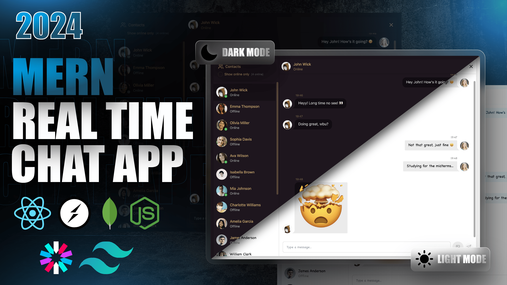

# ✨ Full Stack Realtime Chat App ✨  
## Super Chats  
### Real Time Communications App.

---

  

This is a fully functional **real-time chat application** built using the **MERN stack**, **Socket.io**, **TailwindCSS**, and **DaisyUI**. The app provides a seamless messaging experience with features similar to WhatsApp, including real-time updates, online status, and image sharing.  

---

## 🌟 Features  

- **Real-Time Messaging**: Powered by **Socket.io** for instant communication.  
- **Authentication & Authorization**: Secure login and signup using **JWT (JSON Web Tokens)**.  
- **Online Status**: Real-time updates to show when users are online or offline.  
- **Responsive Design**: Styled with **TailwindCSS** and **DaisyUI** for a modern, responsive, and customizable interface.  
- **Global State Management**: Efficient state handling with **Zustand** for a smooth user experience.  
- **Error Handling**: Robust error management on both the server and client sides.  
- **Image Upload**: Integrated with **Cloudinary** for seamless media handling and storage.  
- **Theme Customization**: Users can switch between multiple themes, with preferences saved in **local storage**.  
- **Free Deployment**: Easily deployable on free platforms like **Vercel** or **Render**.  

---

## 🚀 Tech Stack  

- **Frontend**: React, TailwindCSS, DaisyUI, Zustand, Axios  
- **Backend**: Node.js, Express.js, MongoDB, Mongoose  
- **Real-Time Communication**: Socket.io  
- **Authentication**: JSON Web Tokens (JWT)  
- **Image Upload**: Cloudinary  
- **Hosting**: Vercel (frontend), Render/Heroku (backend)  

---

## 📸 Screenshots  

  

---

## ⚙️ Setup  

### Prerequisites  

Ensure you have the following installed:  
- **Node.js** (v16 or higher)  
- **MongoDB** (or a MongoDB Atlas connection string)  

### 1. Clone the Repository  

```shell  
git clone https://github.com/its-kundan/Super-Chats.git  
cd Super-Chats  
```  

### 2. Setup `.env` File  

Create a `.env` file in the root directory with the following keys:  

```env  
MONGODB_URI=your_mongodb_connection_string  
PORT=5001  
JWT_SECRET=your_jwt_secret  
CLOUDINARY_CLOUD_NAME=your_cloudinary_cloud_name  
CLOUDINARY_API_KEY=your_cloudinary_api_key  
CLOUDINARY_API_SECRET=your_cloudinary_api_secret  
NODE_ENV=development  
```  

### 3. Install Dependencies  

Navigate to the root and frontend folders to install dependencies:  

```shell  
npm install  
cd frontend  
npm install  
```  

### 4. Start the Application  

#### Development Mode  

Start both the frontend and backend servers for development:  

```shell  
npm run dev  
```  

#### Production Build  

To build and start the app in production:  

```shell  
npm run build  
npm start  
```  

---

## 🎯 How to Use  

1. **Register or Log In**: Create an account or log in using your email and password.  
2. **Start Chatting**: Search for users, start a chat, and experience real-time messaging.  
3. **Share Images**: Upload and share images seamlessly using Cloudinary integration.  
4. **Customize Themes**: Switch between multiple themes for a personalized experience.  
5. **Check Online Status**: See when other users are online or offline in real-time.  

---

## 🌐 Deployment  

Deploying this app is simple and free! Follow these steps:  
1. **Frontend**: Deploy the React app on **Vercel**.  
2. **Backend**: Deploy the Node.js app on **Render** or **Heroku**.  
3. **Database**: Use **MongoDB Atlas** for a cloud-based database.  
4. **Environment Variables**: Add your `.env` keys to the deployment platform.  

---

## 🛠️ Contribution  

Contributions are welcome! If you’d like to improve this project, follow these steps:  
1. Fork the repository.  
2. Create a new branch (`git checkout -b feature/YourFeatureName`).  
3. Commit your changes (`git commit -m 'Add some feature'`).  
4. Push to the branch (`git push origin feature/YourFeatureName`).  
5. Open a pull request.  

---

## 📬 Contact  

For any issues, suggestions, or feedback, feel free to reach out:  
- **GitHub Profile**: [its-kundan](https://github.com/its-kundan)  
- **Email**: [kundan51kk@gmail.com](mailto:kundan51kk@gmail.com)  

---

## 🚨 Troubleshooting  

- **Socket.io Connection Issues**: Ensure the backend server is running and the correct URL is used in the frontend.  
- **Image Upload Failures**: Verify your Cloudinary API keys and ensure the file size is within limits.  
- **Authentication Errors**: Double-check your JWT secret and ensure tokens are being sent correctly.  

---
 
