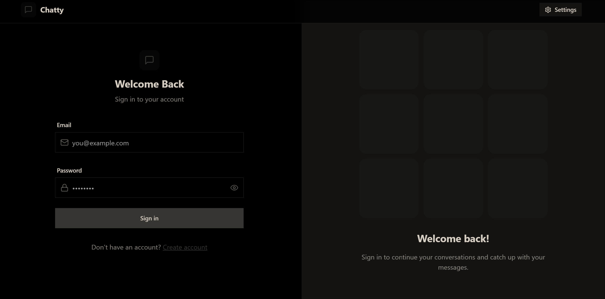

# ✨ NexusChat - Premium Real-Time Chat Application ✨

A premium, modern full-stack real-time chat application built with the MERN stack, featuring glass-morphism design, instant messaging, user authentication, image sharing, and real-time notifications.



## 🌟 Premium Features

### Core Features
- **Real-Time Messaging**: Instant message delivery using Socket.io
- **Premium UI/UX**: Glass-morphism design with smooth animations
- **User Authentication**: Secure JWT-based authentication system
- **Online Status**: Real-time user online/offline indicators with premium styling
- **Image Sharing**: Upload and share images via Cloudinary integration
- **Responsive Design**: Mobile-first design with TailwindCSS and DaisyUI
- **Premium Themes**: Luxury theme with custom gradients and animations
- **Global State Management**: Efficient state handling with Zustand

### Premium Design Features
- **Glass-Morphism Effects**: Modern translucent UI elements
- **Gradient Animations**: Smooth animated backgrounds and elements
- **Premium Color Scheme**: Custom luxury theme with purple gradients
- **Micro-Interactions**: Hover effects, transitions, and animations
- **Custom Scrollbars**: Premium styled scrollbars with gradients
- **Premium Typography**: Modern font styling with gradient text effects
- **Floating Elements**: Animated background elements for depth

### Technical Features
- **Real-Time Communication**: Socket.io for instant updates
- **Secure Authentication**: JWT tokens with HTTP-only cookies
- **Image Upload**: Cloudinary integration for media storage
- **Error Handling**: Comprehensive error management
- **Performance Optimized**: Efficient data fetching and caching
- **Cross-Platform**: Works on desktop, tablet, and mobile devices

## 🚀 Tech Stack

### Frontend
- **React 18** - UI library
- **Vite** - Build tool and dev server
- **TailwindCSS** - Utility-first CSS framework
- **DaisyUI** - Component library for TailwindCSS
- **Zustand** - State management
- **Socket.io Client** - Real-time communication
- **Axios** - HTTP client
- **React Router DOM** - Client-side routing
- **React Hot Toast** - Toast notifications
- **Lucide React** - Icon library

### Backend
- **Node.js** - Runtime environment
- **Express.js** - Web framework
- **MongoDB** - NoSQL database
- **Mongoose** - MongoDB ODM
- **Socket.io** - Real-time communication
- **JWT** - Authentication
- **bcryptjs** - Password hashing
- **Cloudinary** - Image upload service
- **CORS** - Cross-origin resource sharing
- **Cookie Parser** - Cookie handling

### Development Tools
- **ESLint** - Code linting
- **Nodemon** - Development server
- **PostCSS** - CSS processing
- **Autoprefixer** - CSS vendor prefixes

## 📸 Screenshots


## 🏗️ Project Structure

```
NexusChat/
├── backend/                 # Backend API server
│   ├── src/
│   │   ├── controllers/     # Route controllers
│   │   ├── middleware/      # Custom middleware
│   │   ├── models/          # Database models
│   │   ├── routes/          # API routes
│   │   ├── lib/             # Utility libraries
│   │   └── index.js         # Server entry point
│   └── package.json
├── frontend/                # React frontend
│   ├── src/
│   │   ├── components/      # React components
│   │   ├── pages/           # Page components
│   │   ├── store/           # Zustand stores
│   │   ├── lib/             # Utility functions
│   │   └── main.jsx         # App entry point
│   └── package.json
└── README.md
```

## ⚙️ Installation & Setup

### Prerequisites

- **Node.js** (v16 or higher)
- **npm** or **yarn**
- **MongoDB** (local or MongoDB Atlas)
- **Cloudinary** account (for image uploads)

### 1. Clone the Repository

```bash
git clone https://github.com/yourusername/NexusChat.git
cd NexusChat
```

### 2. Environment Configuration

Create a `.env` file in the root directory:

```env
# Server Configuration
PORT=5001
NODE_ENV=development

# Database
MONGODB_URI=your_mongodb_connection_string

# Authentication
JWT_SECRET=your_jwt_secret_key_here

# Cloudinary Configuration
CLOUDINARY_CLOUD_NAME=your_cloudinary_cloud_name
CLOUDINARY_API_KEY=your_cloudinary_api_key
CLOUDINARY_API_SECRET=your_cloudinary_api_secret
```

### 3. Install Dependencies

```bash
# Install backend dependencies
cd backend
npm install

# Install frontend dependencies
cd ../frontend
npm install
```

### 4. Start Development Servers

#### Option 1: Run Both Servers (Recommended)
```bash
# From root directory
npm run dev
```

#### Option 2: Run Servers Separately
```bash
# Backend (Terminal 1)
cd backend
npm run dev

# Frontend (Terminal 2)
cd frontend
npm run dev
```

### 5. Access the Application

- **Frontend**: http://localhost:5173
- **Backend API**: http://localhost:5001

## 🎯 Usage Guide

### Authentication
1. **Sign Up**: Create a new premium account with email and password
2. **Log In**: Use your credentials to access the premium chat experience
3. **Profile**: Update your profile picture and information

### Messaging
1. **User List**: View all available users in the premium sidebar
2. **Start Chat**: Click on any user to start a conversation
3. **Send Messages**: Type text messages or upload images with premium styling
4. **Real-Time**: Messages appear instantly with smooth animations

### Premium Features
- **Online Status**: See who's currently online with premium indicators
- **Premium Theme**: Enjoy the luxury theme with custom gradients
- **Image Sharing**: Upload and share images in conversations
- **Responsive Design**: Premium experience on any device size
- **Glass-Morphism**: Modern translucent UI elements throughout

## 🌐 Deployment

### Frontend Deployment (Vercel)

1. **Build the Project**:
   ```bash
   cd frontend
   npm run build
   ```

2. **Deploy to Vercel**:
   - Connect your GitHub repository to Vercel
   - Set build command: `npm run build`
   - Set output directory: `dist`
   - Add environment variables

### Backend Deployment (Render/Heroku)

1. **Prepare for Deployment**:
   ```bash
   cd backend
   npm install
   ```

2. **Environment Variables**:
   - Set all required environment variables
   - Update CORS settings for production domain

3. **Deploy**:
   - Connect to Render/Heroku
   - Set start command: `npm start`
   - Configure environment variables

### Database Setup

1. **MongoDB Atlas** (Recommended):
   - Create a free cluster
   - Get connection string
   - Add to environment variables

2. **Local MongoDB**:
   - Install MongoDB locally
   - Start MongoDB service
   - Use local connection string

## 🔧 API Documentation

For detailed API documentation, see [API.md](./API.md)

### Key Endpoints

- `POST /api/auth/signup` - User registration
- `POST /api/auth/login` - User authentication
- `GET /api/messages/users` - Get all users
- `GET /api/messages/:id` - Get conversation messages
- `POST /api/messages/send/:id` - Send a message

## 🛠️ Development

### Available Scripts

#### Backend
```bash
npm run dev    # Start development server with nodemon
npm start      # Start production server
```

#### Frontend
```bash
npm run dev    # Start development server
npm run build  # Build for production
npm run lint   # Run ESLint
npm run preview # Preview production build
```

### Code Style

- **ESLint** configuration for consistent code style
- **Prettier** for code formatting
- **Conventional commits** for commit messages

## 🧪 Testing

```bash
# Run backend tests (if implemented)
cd backend
npm test

# Run frontend tests (if implemented)
cd frontend
npm test
```

## 🤝 Contributing

We welcome contributions! Please follow these steps:

1. **Fork** the repository
2. **Create** a feature branch (`git checkout -b feature/AmazingFeature`)
3. **Commit** your changes (`git commit -m 'Add some AmazingFeature'`)
4. **Push** to the branch (`git push origin feature/AmazingFeature`)
5. **Open** a Pull Request

### Contribution Guidelines

- Follow the existing code style
- Add tests for new features
- Update documentation as needed
- Ensure all tests pass before submitting

## 📝 License

This project is licensed under the MIT License - see the [LICENSE](LICENSE) file for details.

## 🐛 Troubleshooting

### Common Issues

**Socket.io Connection Issues**
- Ensure backend server is running
- Check CORS configuration
- Verify frontend URL in backend settings

**Image Upload Failures**
- Verify Cloudinary credentials
- Check file size limits
- Ensure proper image format

**Authentication Errors**
- Clear browser cookies
- Check JWT secret configuration
- Verify token expiration settings

**Database Connection Issues**
- Check MongoDB connection string
- Ensure MongoDB service is running
- Verify network connectivity

## 📞 Support

For support and questions:

- **GitHub Issues**: [Create an issue](https://github.com/yourusername/NexusChat/issues)
- **Email**: your-email@example.com
- **Documentation**: Check the [API.md](./API.md) file

## 🙏 Acknowledgments

- **Socket.io** for real-time communication
- **TailwindCSS** for the beautiful UI framework
- **Cloudinary** for image hosting
- **MongoDB** for the database solution
- **React** community for the amazing ecosystem

---

**Made with ❤️ by [Your Name]**
 
